# How to Write Your Own Transforms

- 26 Minute Read

## Summary 
* In this tutorial, we will write our own custom transforms to illustrate the 
structure of parameterized transforms as described in the previous tutorial.
* We will write one custom atomic transform `RandomColorErasing` and one custom composing transform `RandomSubsetApply`.
* We will then visualize sample augmentations generated by these transforms along with the parameters corresponding to 
those augmentations.

## A Quick Recap of the Atomic Transform Structure
Recall that to define your own atomic transform, you can do the following--
> 1. **Subclass from `AtomicTransform`.**
> 2. **Define the attributes `tx_mode` and `param_count`; you may choose to do so with your concrete definition of the `set_param_count` method for the latter.**
> 3. **Define your concrete implementation of `get_raw_params` method.**
> 4. **Define your concrete implementation of `apply_transform` method.**
> 5. **Define your concrete implementation of `post_process_params` method.**
> 6. **Define your concrete implementation of `extract_params` method.**
> 7. **Define your concrete implementation of `pre_process_params` method.**
> 8. **Define your concrete implementation of `get_default_params` method.**
> 9. **(Optional) Define your concrete implementation of `__str__` method.**

## `RandomColorErasing`: A Custom Atomic Transform
* **Follow the notebook 
[002-001-RandomColorErasing.ipynb](https://github.com/apple/parameterized-transforms/blob/main/examples/002-001-RandomColorErasing.ipynb)
while going through the details below.**

* Let us write a transform `RandomColorErasing` that inputs `PIL`-images and erases a randomly selected rectangular 
region of the image by replacing it with a randomly sampled color.
* Since we want a well-defined and simple functionality, we implement it as an atomic transform. 
Thus, **we subclass from `AtomicTransform`** to derive the `RandomColorErasing` class.

### The Initializer `__init__`
* The initializer of the class **sets the transform mode `tx_mode`** and 
the default parameters mode `default_params_mode`.
The former is a requirement as per the transform structure and the latter is needed since this transform has multiple 
default parameter possibilities, as explained later on.
* The initializer **sets the number of parameters of the transform `param_count`**, 
which is `7`.
This is because we need to uniquely describe the rectangle to be erased and the fill-color for this erased region. 
The rectangle can be uniquely defined with `4` parameters; two parameters describing the coordinates of the 
location of the rectangle, which is defined as its top-left corner, and two more parameters describing its size, which 
comprises of its height and width. 
Next, the fill-color can be captured with `3` parameters for its `(r, g, b)` values.
Thus, we need `7` parameters in total, which is why we have `param_count = 7`.

### Getting Raw Parameters with `get_raw_params`
* We define **our 
implementation of `get_raw_params`** as follows.
* The raw parameters are the `4` parameters for the rectangle to be erased `i, j, h, w`,
The tuple `(i, j)` represents the top-left corner of the rectangle in height-first format.
The tuple `(h, w)` represents the tuple of the height and width of this rectangle.
* We define a random color to be used for filling in the erased image, the `fill_color`, as an `np.ndarray` instance 
of size `[3, ]` and of dtype `np.uint8`. 
* Thus, the raw parameters is the tuple `(i, j, h, w, fill_color)`, which is output by this method.

### Applying the Transform with `apply_transform`
* We define the **our implementation of `apply_transform`** in a straightfoward manner as follows.
* We select the rectangle slice of the image starting at pixel `(i, j)` and of shape `(h, w)`.
This slice is replaced with the color `fill_color`. 
We then return the augmented image to complete the implementation.

### Standard Format Parameters with `post_process_params`
* Our implementation requires that final parameters to be output by the transform MUST be a tuple of scalars.
* Thus, we define **our implementation of `post_process_params`** as follows.
* We take the starting pixel `(i, j)`, rectangle size `(h, w)`, and the fill color `fill_color = array([r, g, b])`, and return the `7`-tuple of parameters `(i, j, h, w, r, g, b)`.

### Extracting Required Parameters with `extract_params`
* The scenario for this function is that we are given a tuple of scalar parameters and we want to extract the 
parameters that we need for the current transform. 
By design, these required parameters are going to be at the beginning of the parameters tuple.
* Thus, we define **our implementation of `extract_params`** as follows.
* We extract the first `self.param_count` many parameters as the required processed parameters and keep the rest of the 
parameters to the next transforms.
* Note that in almost all the cases, this is going to be *the* implementation of this `post_process_params`.

### Recovering Raw Parameters with `pre_process_params`
* Note that the extracted parameters are going to be post-processed versions of the corresponding raw parameters.
Thus, we need to convert these back to obtain these raw parameters, which can then be used to apply the transform.
* Thus, we define **our implementation of `pre_process_params`** as follows.
* We keep the `i, j, h, w` parameters as is and convert the last three scalar parameters `r, g, b` into a 
`numpy.ndarray` instance of size `[3, ]` and dtype `np.uint8` to obtain the fill color `fill_color`.
* We then return the tuple of the recovered raw parameters `(i, j, h, w, fill_color)`.

### Defining Default Parameters with `get_default_params`
* This is a tricky method as we want to define the default parameters, which preserve the image as much as possible.
* In case of this transform, we can indeed obtain an "identity transform"; we can define parameter settings such that 
the transformed image will be identical to the input one.
In fact, we have more than one parameter settings that can preserve the identity of the image. 
Thus, we also choose to provide control over these identity parameters via the `DefaultParamsMode` enum and the 
`default_params_mode` attribute.
* With this in consideration, we define **our implementation of `get_default_params`** 
as follows.
* First, note that if `default_params_mode` is `DefaultParamsMode.UNIQUE`, we can use the location of the rectangle 
to be erased as `(i=0, j=0)` and keep its height and width as `(h=0, w=0)`.
Here, the idea is that a rectangle at location `(0, 0)` and of shape `(0, 0)` is being erased, which means that we are 
NOT erasing anything. 
Further, we define the `fill_color` to be `(r=0, g=0, b=0)` to fill in the erased rectangle.
Thus, the processed default parameters for `default_params_mode = DefaultParamsMode.UNIQUE` are the tuple 
`(0, 0, 0, 0, 0, 0, 0)`.
* Otherwise, we have `default_params_mode = DefaultParamsMode.RANDOMIZED` and we want to obtain randomized default 
parameters. 
We can indeed have randomized default parameters because a `(0, 0)` shaped rectangle at **ANY** location in the image 
will leave the image unchanged. 
Further, vacuously, this rectangle can be colored with **ANY** fill color and we will still get the same image back.
    * Note that we can have some other ways in which we can obtain an identity transform too. 
    * For instance, we can have any location for rectangle to be erased, any color to fill in this region, but exactly 
    one of height and width to be 0. 
    * This parameter setting is indeed possible to achieve an identity transform but for the sake of simplicity in this 
    example, we will ignore these parameter settings!
* Thus, in this remaining case, we sample any valid location `(sample_i, sample_j)` in the input image for the 
rectangular region to be erased.
We define the height and width of this rectangle to be `(h=0, w=0)`.
Finally, we sample any color `(sample_r, sample_g, sample_b)` to be used to fill in this rectangular region.
And thus, the returned default parameters by this transform will be the sample-- 
`(sample_i, sample_j, 0, 0, sample_r, sample_g, sample_b)`.

And that's it! We have written our own parameterized transform!
Now, we will write a custom composing transform to illustrate its structure.
As we will see, the structure for composing transforms is almost the same as that for atomic transforms but with minor changes. 

## A Quick Recap of the Composing Transform Structure
Recall that to define your own composing transform, you can do the following--
> 1. **Subclass from `ComposingTransform`.**
> 2. **Define the attributes `tx_mode` and `param_count`; you may choose to do so with your concrete definition of the `set_param_count` method for the latter.**
> 3. **Define the core transform with the attribute `transforms`.**
> 4. **Define your concrete implementation of `get_raw_params` method.**
> 5. **Define your concrete implementation of `apply_cascade_transform` method.**
> 6. **Define your concrete implementation of `post_process_params` method.**
> 7. **Define your concrete implementation of `extract_params` method.**
> 8. **Define your concrete implementation of `pre_process_params` method.**
> 9. **Define your concrete implementation of `apply_consume_transform` method.** 
> 10. **Define your concrete implementation of `get_default_params` method.**
> 11. **(Optional) Define your concrete implementation of `__str__` method.**

## `RandomSubsetApply`: A Custom Composing Transform
* **Follow the notebook 
[002-002-RandomSubsetApply.ipynb](https://github.com/apple/parameterized-transforms/blob/main/examples/002-002-RandomSubsetApply.ipynb)
while going through the details below.**

* Let us write a transform `RandomSubsetApply` that wants to perform the following functionality. 
Given a sequence of transforms `t1, t2, ..., tN`, it flips a coin for each transform and based on the outcome, decides 
to either apply that transform or skip applying that transform.
As a concrete example, suppose we are given transforms `RandomRotation`, `ColorJitter`, and `RandomAffine`.
We flip a coin thrice and observe `H`, `T`, `H`. 
Then, we apply `RandomRotation` to get partially augmented image, skip `ColorJitter`, and finally apply `RandomAffine` 
on the partially augmented image to get the final augmentation.
  * We name this transform so because effectively, we are taking a subset of all the transforms and applying in order!
* Firstly, we observe that this transform inputs a variable number of other transforms and defines a composing behavior 
on top of their functionality. 
Thus, **we subclass from `ComposingTransform`** to define our 
`RandomSubsetApply` class.

### The Initializer `__init__`
* Since we need to work with any number of core transforms, we **set the attribute 
`transforms`** to hold the list of input core transforms.
* As seen before in the case of `RandomColorErasing`, we **set the transform mode 
`tx_mode` attribute**.
* Now, we need to set the `param_count` attribute, which is interesting!
For this, we first need to decide how we want to parameterize the augmentation strategy.
In this example, we will go about it as follows.
When a core transform is indeed chosen to be applied, we will take its augmentation parameters.
However, when a transform is skipped, we will use its default parameters, which are intended to act as 
identity-preserving parameters by design.
  * There can be several ways to parameterized the transform uniquely and we provide one such way here!
* Thus, the total parameter count for our composing transform is simply going to be the sum of the parameter counts of 
all the core transforms. 
Towards this, we have a special helper function in `parameterized_transforms/utils.py`, 
named `get_total_params_count`. 
Thus, we **set the `param_count` attribute** of the transform using it.
* In addition, we also set extra attributes `idx_limits` and `num_core_transforms` as we will need them later on.
The former attribute holds the indices where parameters of different core transforms begin and end and the latter 
attribute holds the total number of core transforms.
For convenience, let us say that there are `N` core transforms.

### Getting Raw Parameters with `get_raw_params`
* We define **our implementation of `get_raw_params`** as follows. 
* The raw parameters of our transform are going to be `N` coin flips, where the `i-`th
coin flip decides whether to apply or skip the transform. 
* We encode this using an `[N, ]` shaped `numpy.ndarray` with values `0` and `1`, representing the outputs of the coin 
tosses and return it as a tuple.

### Applying the CASCADE Mode Transform with `apply_cascade_transform`
* Now, having access to the raw parameters, we easily define **our implementation of 
`apply_cascade_transform`** as follows.
* For each transform `tx` in core transforms, we check if we want to use it or skip it based on the corresponding raw 
parameter.
If we want to use the core transform, we ask the core transform to apply a random augmentation and collect the 
corresponding augmentation parameters.
However, if we want to skip the core transform, we ask the core transform to get its default parameters, *apply those 
parameters on the image to get the default-augmented image*, and collect the default parameters.
  * Here, the reason to apply the default augmentations is very subtle.
  It can help in the cases where the augmentation output by one transform might affect the augmentation parameters of 
  the next transform in line.
We then concatenate all the collected augmentation parameters together.
Finally, we return the tuple of the augmented image and the combined parameters as output. 
* Here, we can find a subtle difference in the structure of composing transforms versus that of the atomic transforms.
The atomic transforms only have one method `apply_transform`, whereas composing transforms have two separate 
methods-- `apply_cascade_transform` and `apply_consume_transform`.
The reason for this will be apparent later on but in brief, this is required due to possibly different functionalities 
for the core transform based on the mode of the composing transform.
* Another subtle difference is the signature of these methods; `apply_transform` only returns an `IMAGE_TYPE` instance, 
whereas `apply_cascade_transform` and `apply_consume_transform` return a tuple of `IMAGE_TYPE` and `PARAM_TYPE`. 
The reason for this is that we want to have access to the augmentation parameters of the core transforms. 

### Standard Format Parameters with `post_process_params`
* Here, we define **our implementation of `post_process_params`**.
* As the structure of composing transform shows, there is a subtle difference in the signatures of this method in the 
atomic and the composing transform templates.
In composing transforms, this method inputs the image along with two groups of parameters-- 1. `params`, representing 
the local raw parameters of the composing transforms, and 2. `aug_params`, the augmentation parameters collected from 
the core transforms. 
The job of this method is to post-process both these groups of parameters and return their processed versions.
* In our case, by design, the local raw parameters are redundant; the augmentation parameters, along with the 
`idx_limits` attribute essentially encode all the information that we need to uniquely describe the parametrization.
* Thus, we simply ignore the `params` and return the tuple `(), aug_params` as output!

### Extracting Required Parameters with `extract_params`
* Again, as seen before, the scenario for this function is that we are given a tuple of scalar parameters and we want 
to extract the parameters that we need for the current composing transform. 
These required parameters are going to be at the beginning of the input parameters tuple.
* Thus, we define **our implementation of `extract_params`** exactly as done before.
* We extract the first `self.param_count` many parameters as the required processed parameters and keep the rest of the 
parameters to the next transforms.

### Recovering Raw Parameters with `pre_process_params`
* This is another place where the composing transform structure differs subtly from the atomic transform structure.
Obviously, we want to recover raw parameters from the extracted parameters but in this case, we want to recover the 
local raw parameters that would be needed by the transform to perform the task of applying CONSUME mode transform 
AS WELL AS the processed augmentation parameters to be supplied to the core transform to make it perform the task of 
applying its CONSUME mode transform.
Thus, instead of returning a single parameter group, here we return a tuple of two parameter groups.
* Thus, we define **our implementation of `pre_process_params`** as follows.
* Since all the required information would be present in the augmentation params to be fed to the core transforms, we 
ignore the local raw parameter requirement and return the tuple of empty parameters (for the local raw parameters) and 
the input `params` as they are (for augmentation parameters).

### Applying the CONSUME Mode Transform with `apply_consume_transform`
* We define **our implementation of the `apply_consume_transform`**, which is a 
separate method to be used to input the local raw parameters as well as augmentation parameters for the core 
transforms, and return the corresponding augmentation obtained with these parameters.
* Since local raw parameters are `()` as explained above, we just use the augmentation parameters and chunk them using 
the `idx_limits` attribute to recover the augmentation parameter of each of the core transforms in order.
* We then just apply these chunked augmentation parameters in order on the core transforms and get the required image.
* For the sake of a safety check, we return the augmented image along with the remaining augmentation parameters.
  * If everything is working correctly, the remaining augmentation parameters MUST be empty, i.e., `()`!

### Defining Default Parameters with `get_default_params`
* We define **our implementation of the `get_default_params`**, which returns the 
default parameters of this composing transform. 
* Now, note that this transform can preserve identity by just using the default parameters of each of the core 
transforms; note that which transform were actually used and which were skipped becomes irrelevant in this 
parametrization scheme!
* Thus, we simply obtain the default parameters of each of the core transforms, *apply these default parameters on the 
image to obtain its default-augmented version*, and return the combined default augmentation parameters!
  * As seen before, the application of default parameters is a subtle but important detail; it might be possible that 
  application of a transform might affect the default parameters for some transform next-in-line.

And voilà! We have written our own custom composing transform!

## Visualizing Augmentations with `RandomColorErasing` and `RandomSubsetApply`
* **Follow the notebook 
[002-003-Visualizations.ipynb](https://github.com/apple/parameterized-transforms/blob/main/examples/002-003-Visualizations.ipynb)
while going through the details below.**
* Now, having implemented the transforms `RandomColorErasing` and `RandomSubsetApply`, we visualize the augmentations 
generated by them.
This visualization is only for the sake of verification of the efficacy of the transforms and we will explore the power 
and capabilities of the parameterized transforms in a subsequent tutorial.
In the notebook for this section, we provide a function named `show_image` to quickly visualize different images.
* We will visualize the augmentations with two beautiful images-- 
[Curly](assets/cat.jpeg), the cat,
and 
[Pep](assets/dog.jpeg), the dog. 
These images are displayed below--

<!--suppress ALL -->

|                     Curly, the Cat                      |                      Pep, the Dog                      |
|:-------------------------------------------------------:|:------------------------------------------------------:|
|  |  |

### Visualizing `RandomColorErasing`
* We will visualize the augmentations generated by the `RandomColorErasing` with Curly, the cat.
* Let us create an instace `tx_RCE` of our `RandomColorErasing` transform and print it to see the output of our custom `__str__` method.
* Next, we generate multiple samples from our transform. 
Observe that the augmentations consist of a rectangular region of the image being erased and replaced by a random 
color, which is the desired behavior of the transform.
Also, observe the parameters of this augmentation and check whether the location and size of the erased rectangle 
as well as the color used for filling in the erased rectangle are consistent and make sense!
* Here are some of the augmentations generated by our transform--

|                                                                          |                                                                         |
|--------------------------------------------------------------------------|-------------------------------------------------------------------------|
| 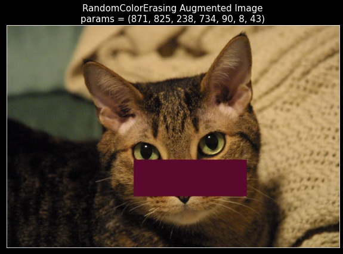 | 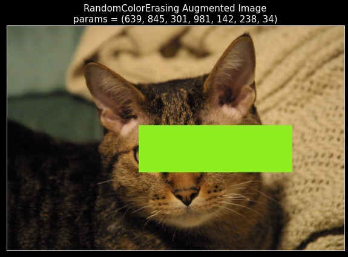 |
| 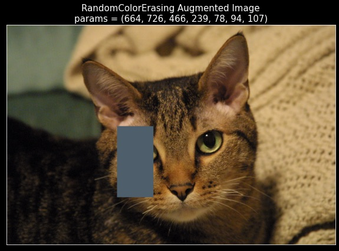 | 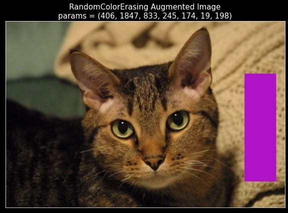 |
| 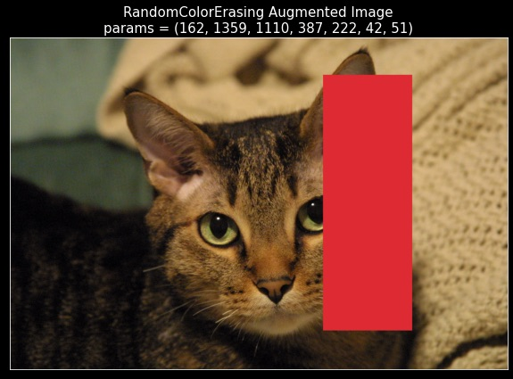 | 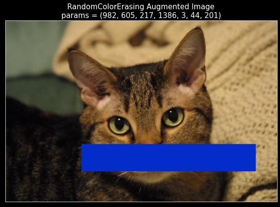 |

**Note that in some cases, the erased rectangle can be difficult to spot due to the size or fill-in color of the erased rectangle.**

* Next, we also perform two sanity checks--
  1. Let us say that for the original image of Curly, we pass it through the CASCADE mode of `tx_RCE` and obtain an 
  augmentation `aug` and corresponding parameters `params`.
  Now, by definition, if we were to take the original image of Curly along with these parameters `params`, and pass it through the 
  CONSUME mode of the `tx_RCE` transform, we ought to get the same augmented image `aug` back.
  We can observe that this is indeed the case!
  2. Note that the default parameters for `RandomColorErasing` transform indeed preserve the image and act as identity transform parameters.
  Thus, if we were to pass the original image of Curly, along with the default parameters, and pass these through 
  the CONSUME mode of the `tx_RCE` transform, we ought to get the original image back.
  We can also observe that this too is indeed true!
* So, we can see that our custom atomic transform `RandomColorErasing` behaves as expected!
    

### Visualizing `RandomSubsetApply`
* We will visualize the augmentations generated by the `RandomColorErasing` with Pep, the dog.
* Note that `RandomSubsetApply` is a composing transform and requires one or more core transform(s) in order to 
function properly. 
Given these core transforms, this composing transform will select a subset of the core transforms and apply them 
IN ORDER (i.e., in the order in which they appear in the core transforms).
* Thus, we will use the following two transforms as the core transforms for `RandomSubsetApply`-- one instance of our 
own `RandomColorErasing` transform and one instance of `RandomRotation` transform provided by our package.
    * This `RandomRotation` transform inputs an image and rotates it by a random angle sampled from the range provided 
    to it.
* So, let us create an instace `tx_RSA` of our `RandomSubsetApply` transform as described above containing the following core transforms in the given order--
  1. `RandomColorErasing(param_count=7, tx_mode=TransformMode.CASCADE, default_params_mode=DefaultParamsMode.RANDOMIZED)`,
  which erases a randomly chosen rectangle from the image and replaces it with a randomly chosen fill-in color, and
  2. `RandomRotation(degrees=[-30.0, 30.0], interpolation=InterpolationMode.NEAREST, expand=False, center=None, fill=0, param_count=1, tx_mode=TransformMode.CASCADE)`,
  which rotates the input image by a randomly sampled angle (in degrees) from the range `[-30.0, 30.0]`.
Here, we see the utility of defining the custom implementation of `__str__`; it allows for a clean, readable 
description of the transform, and may also help in debugging issues with complex transforms.
* Since our composing transform flips a (fair) coin per core transform and choses to apply it or skip, it should result 
in the following behavior--
  1. With probability `1/4`, it skips both the transforms and keeps the image as it is. 
  2. With probability `1/4`, it ONLY applies the `RandomColorErasing` transform, thereby erasing a randomly chosen 
  rectangle from the image and filling it in with a randomly chosen color, and skips the `RandomRotation` transform. 
  3. With probability `1/4`, it skips the `RandomColorErasing` transform and applies ONLY the `RandomRotation` 
  transform, which rotates the original image by a randomly chosen angle (in degrees) from the range `[-30.0, 30.0]`.
  4. With probability `1/4`, it first applies the `RandomColorErasing` to erase a randomly chosen rectangular region 
  from the image and to fill it in with a randomly chosen color. It then applies the `RandomRotation` transform to 
  rotate this partially augmented image by a randomly chosen angle (in degrees) from the range `[-30.0, 30.0]`.
* **Thus, extremely importantly, we will NEVER observe images that are rotated but have a rectangular region colored 
with a random color that is axis-aligned with the original image, which would be the result of first applying the 
`RandomRotation` core transform followed by the `RandomColorErasing` core transform.**  
* Further, by definition of composing transforms, the output parameters will be a tuple of `8` scalars, the first `7` 
scalars representing the parameters for the `RandomColorErasing` transform and the last parameter will be the angle of 
rotation of the image in degrees, which is the single parameter generated by the `RandomRotation` core transform.
* Here are some of the augmentations generated by our transform--

|                                                                          |                                                                         |
|--------------------------------------------------------------------------|-------------------------------------------------------------------------|
| 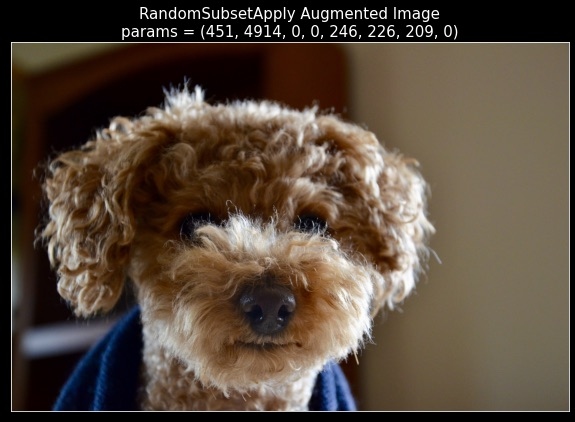 |  |
| 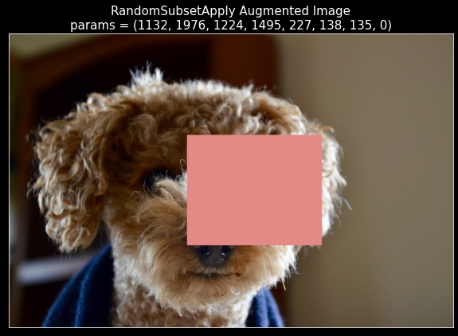 | 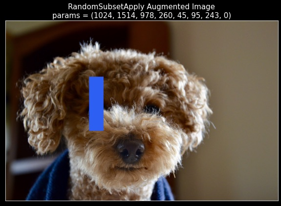 |
| 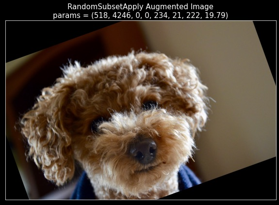 | 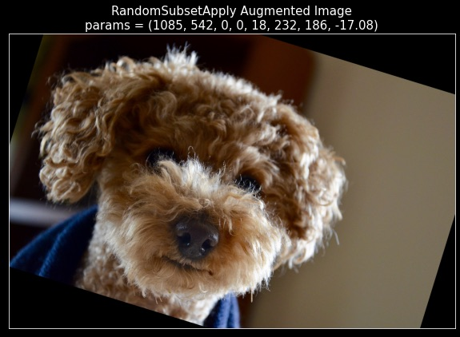 |
| 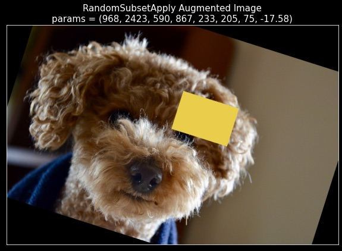 | 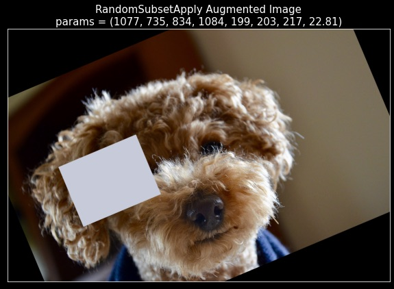 |

**Note that in some cases, the erased rectangle can be difficult to spot due to the size or fill-in color of the erased rectangle.** 
**Ensure that the parameters for the augmentations make sense and that the fraction of different types of behaviors 
of this composing transform is consistent with the description above.**

* Further, ensure that you do NOT see any augmentations where the image is rotated by a non-zero angle but it has a 
non-rotated rectangular patch erased and colored with a random color.
This is because as explained above, that behavior would be the result of first applying `RandomRotation` and then `RandomColorErasing`. 
In particular, you should NOT observe any image similar to the ones shown below--

|                                                                                     |                                                                                    |
|-------------------------------------------------------------------------------------|------------------------------------------------------------------------------------|
| 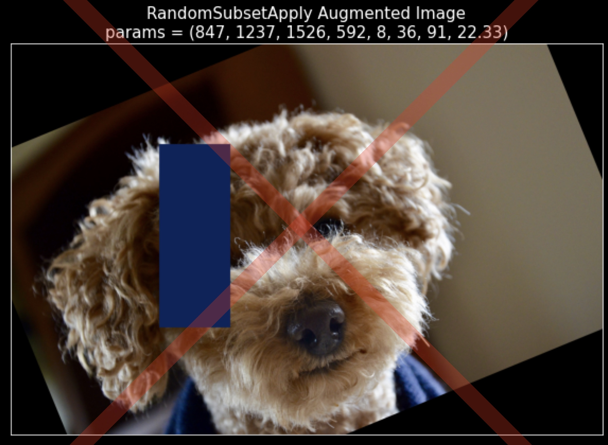 | 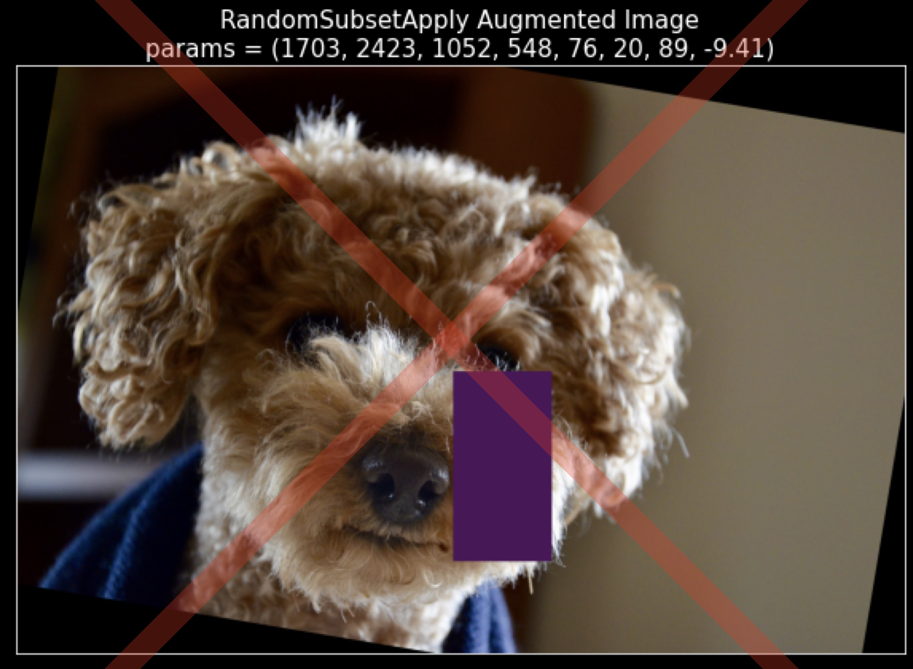 |
| 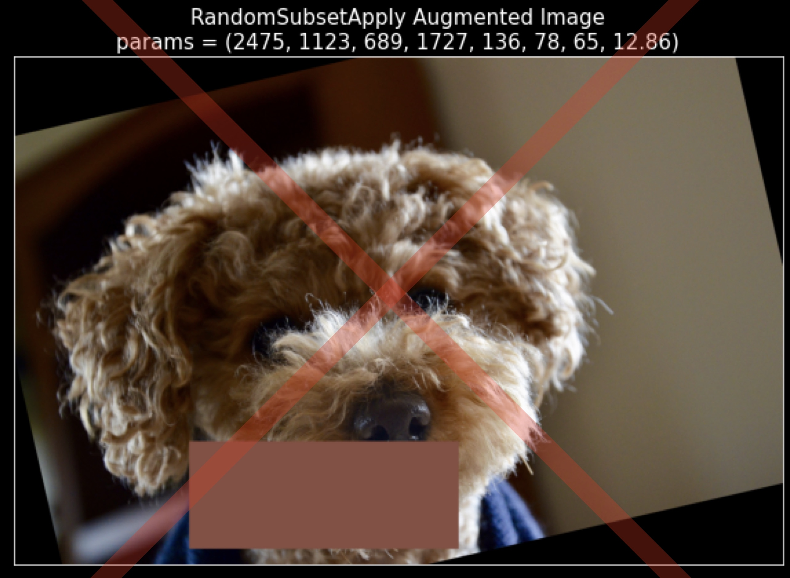 | 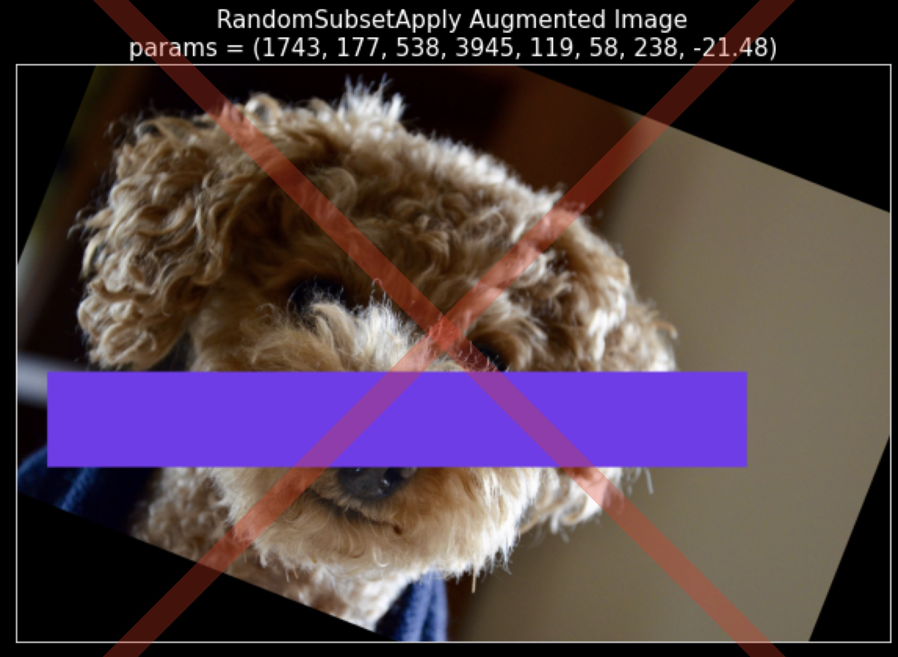 |

* Next, similar to the case of `RandomColorErasing`, we also perform two sanity checks for the `RandomSubsetApply` transform--
  1. Let us say that for the original image of Pep, we pass it through the CASCADE mode of `tx_RSA` and obtain an 
  augmentation `aug` and corresponding parameters `params`.
  Now, by definition, if we were to take the original image of Pep along with these parameters `params`, and pass it through the 
  CONSUME mode of the `tx_RSA` transform, we ought to get the same augmented image `aug` back.
  We can observe that this is indeed the case!
  2. Note that the default parameters for `RandomSubsetApply` transform indeed preserve the image and act as identity transform parameters.
  This is because by definition, the identity parameters of `RandomSubsetApply` are a concatenation of the identity parameters 
  of `RandomColorErasing` and the identity parameters of `RandomRotation`, both of which preserve the image identity separately. 
  Thus, if we were to pass the original image of Pep the cat, along with the default parameters, through 
  the CONSUME mode of the `tx_RSA` transform, we ought to get the original image of Pep back.
  We can observe that this too is indeed true!
* So, we can see that our custom composing transform `RandomSubsetApply` behaves as expected!

## About the Next Tutorial
* Now that we have written our own parameterized transforms and verified experimentally that they work as expected, we 
will see the transforms that are already provided in the package in our next tutorial--
[003-A-Brief-Introduction-to-the-Transforms-in-This-Package](003-A-Brief-Introduction-to-the-Transforms-in-This-Package.md). 
