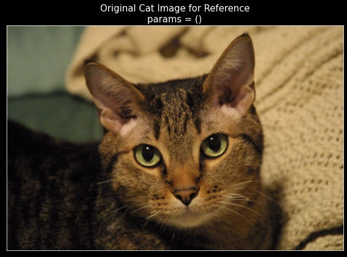
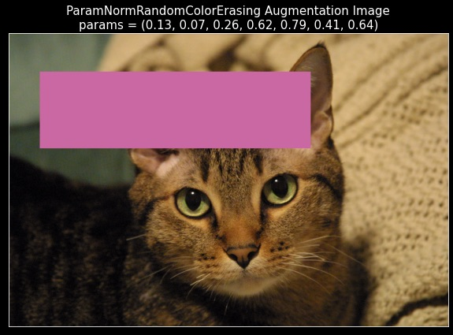
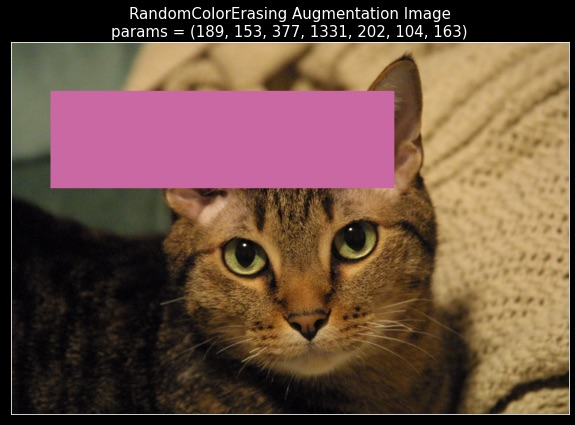
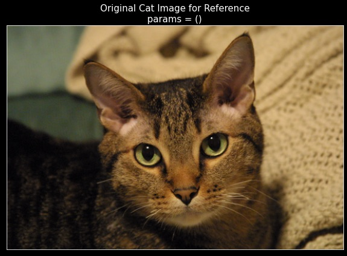
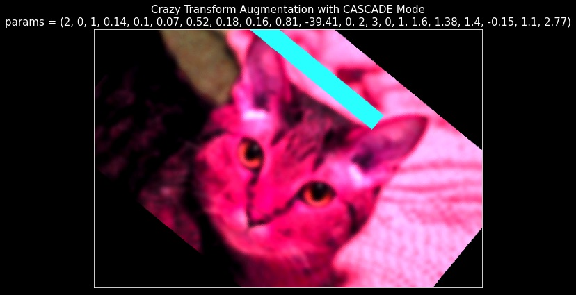

# Parametrized Transforms in Action

- 10 Minute Read


<a name="summary"></a>
## Summary 
* In this tutorial, we will take our custom parameterized transforms defined in a previous tutorial, namely 
`RandomColorErasing` and `RandomSubsetApply`, as well as some of the atomic, composing, and wrapper parameterized transforms provided in the package, and experiment with them! 
We will combine these transforms in different ways and demonstrate how they can provide a wide range of desired 
augmentation functionalities.
* This tutorial should help to further illustrate the power of defining parametrization transforms using the given 
template; in particular, we will see that **defining parameterized transforms with the given template will allow you to 
achieve any desired augmentation behavior with different componenet transforms in a unified and seamless manner!**
* **Follow the notebook 
[004-001-Playground.ipynb](https://github.com/apple/parameterized-transforms/blob/main/examples/004-001-Playground.ipynb)
while going through the details of this tutorial.**
* Here, we will experiment with the image of Curly, the cat, as shown below--

<!--suppress ALL -->
<div align="center">

|                     Curly, the Cat                      |
|:-------------------------------------------------------:|
|  |

</div>


<a name="package-txs"></a>
## Exploring Some Transforms from the Package
* This section helps illustrate the power of the two modes of parameterized transforms, CASCADE and CONSUME, 
and helps in getting acquainted with their performance consistency and consequent augmentation reproducibility.

**1. Modes of Operations and Augmentation Reproducibility**
* To operate any transform in CASCADE mode, one way to achieve this is to define the `tx_mode` attribute of the 
transform to take the value `ptc.TransformMode.CASCADE` and then call this transform.
For example, consider the following chunk of code, which demonstrates different ways to obtain CASCADE and CONSUME mode 
behaviors of the desired transform. 
* One way is to initialize the transform with the correct mode passed as input for 
the `tx_mode` attribute and the other way is no matter what is the mode of the transform, explicitly calling the 
desired transform (i.e., `cascade_transform` or `consume_transform`).
* Further, the consistency in reproducing augmentations is guaranteed!
In particular, as shown in the notebook, the augmented image `aug_cascade` matches exactly with the augmented versions 
`aug_consume` and `aug_consume_alternative`, as it should! 


```python
import parameterized_transforms.transforms as ptx
import parameterized_transforms.core as ptc

tx1 = ptx.RandomRotation(degrees=30, tx_mode=ptc.TransformMode.CASCADE)
aug_cascade, params_cascade = tx1(img=img, params=())  
  # Since `tx1` is in `CASCADE` mode, `__call__` redirects to `cascade_transform.`
aug_consume, params_consume_remaining = tx1.consume_transform(img=img, params=params_cascade)
  # Here, `aug_consume` will exactly match `aug_cascade` from before.
  # Even though `tx1` is in `CASCADE` mode, we can request its output as if it were in `CONSUME` mode!
  # This is achieved with explicitly calling `consume_transform`.
  # And vice versa, explicitly calling `cascade_transform` of a transform in `CONSUME` mode works analogously!

tx2 = ptx.RandomRotation(degrees=30, tx_mode=ptc.TransformMode.CONSUME)
aug_consume_alternative, params_consume_remaining_alternative = \
  tx2(img=img, params=params_cascade)
  # Since `tx2` is in `CONSUME` mode, `__call__` redirects to `consume_transform`.
  # Again, `aug_consume_alternative` will exactly match `aug_cascade`. 
```


**2. Default Parameters and Identity Transform Consistency**
* Further, note that for those transforms where the default parameters preserve the identity of the image, applying the 
default parameters via the CONSUME mode of the transform actually gives the same image back!
  * **Be careful with which transforms have their default parameters acting as identity transform parameters.
  This is because for some transforms, like `Grayscale` or `CenterCrop`, default parameters can lead to loss of information in the image.**
* However, note that `RandomRotation` transform indeed has its default parameters leading to identity transforms and this is 
demonstrated in the notebook.

```python
default_params = tx1.get_default_params(img=img)
default_aug, default_remaining_params = tx1.consume_transform(img=img, params=default_params)
    # Here, the original image `img` matches exactly with the default augmented `default_aug`.
    # And, `default_remaining_params` are empty, as they should be!
```

* We highly encourage the reader to keep in mind these two consistency checks above and try to apply them in the 
provided notebook as and when appropriate!


<a name="extending-RCE"></a>
## Implementing `ParamNormRandomColorErasing` by Extending `RandomColorErasing`


* In this section, we will demonstrate the power of the structure used in defining parameterized transforms by showing 
its capability to easily extend existing transforms.
In particular, let us try to implement a transform `ParamNormRandomColorErasing`, which performs exactly the same 
functionality as that provided by `RandomColorErasing` but provides access to parameters that are "normalized".
  * Here, the location and the size of the rectangle to crop from the image are parameterized as a fraction of the size of the image. 
  * Also, the color used to fill the cropped rectangle is represented as float in range `[0, 1]`.
  * Thus, all the parameters of this transform are in range `[0, 1]`, making the parameterization "normalized". 
We can easily do this by subclassing and extending our already implemented transform `RandomColorErasing`.
* Firstly, observe that we need to update the following two methods from `RandomColorErasing`-- `post_process_params` 
and `pre_process_params`.
This is because for `post_process_params`, if we subclass `RandomColorErasing`, we can have access to the standard 
parameters of the transform via `super` and we would only need to post-process them to obtain the desired normalized parameters.
On the other hand, for `pre_process_params`, we would be having access to normalized parameters and we would only need 
to define a map to un-normalize them and pass to the pre-processing of the `super`.
  * **A subtle point here is that this is it! 
  We ONLY need to update `post_process_params` and `pre_process_params`.
  In particular, our implementation of `get_default_params` does NOT require us to extend it.
  We encourage the reader to think why this is the case!
  Hint- when we subclass, `self` is now an instance of `ParamNormRandomColorErasing` and so, in `get_default_params` 
  implementation of `RandomColorErasing`, our extension of `post_process_params` will be called!**
* We implement this extension `ParamNormRandomColorErasing` as shown in the notebook.
* Finally, we can run the same experiment where we obtain parameters from the `ParamNorm`-version of the transform, manually un-normalize them, and push through the CONSUME mode of the standard 
transform. 
Exactly like the previous section, we see that the augmentations indeed match and we are done! 
* This easy extension of existing transforms is one of the most powerful aspects of our transform design.
* Finally, let us visualize the augmentations obtained in the two aforesaid methods along with the original image for 
reference. 
Observe that the two augmentations match, as expected!


<div align="center">

| Original Image                                                                        |
|---------------------------------------------------------------------------------------|
|  |

</div>


<div align="center">

| Augmentation from `ParamNormRandomColorErasing`                                             | Augmentation from parameterized `RandomColorErasing`                                        |
|---------------------------------------------------------------------------------------------|---------------------------------------------------------------------------------------------|
|  |  |

</div>


<a name="arbit-txs"></a>
## Arbitrarily Composed and Arbitrarily Nested Transforms

* In this final section, we will see another powerful aspect of our design-- we can work with arbitrarily composed and 
arbitrarily nested transforms using package-provided as well as custom parameterized transform components!
* Let us say that we want to research on a very complex and peculiar transform that is meant to have the following 
functionality--
  * It has three components, the first being a `RandomSubsetApply` composing transform with two core transforms-- 1. 
  `ParamNormRandomColorErasing`, and 2. `RandomRotation` that rotates the image by an angle (in degrees) sampled from the 
  range `[-45, 45]`. 
  * The second component is a random choice; we either want to solarize the image with `RandomSolarize` or we want to 
  transform the image randomly with `ColorJitter` (but NOT BOTH)!
  * And the final component is a sequential application of two different `GaussianBlur` transforms in sequence, 
  achieved using the `Compose` transform.
  * And finally, we want to apply these three components on an input image in a random order.
* This functionality is achieved by the following "crazy" transform--
```python
tx = ptx.RandomOrder(
    transforms=[
        # The first component is the `RandomSubsetApply` as seen in previous examples!
        RandomSubsetApply(
            transforms=[
                ParamNormRandomColorErasing(
                    tx_mode=ptc.TransformMode.CASCADE, 
                    default_params_mode=ptc.DefaultParamsMode.RANDOMIZED
                ),
                ptx.RandomRotation(degrees=45)
            ],
            tx_mode=ptc.TransformMode.CASCADE,
        ),
        # The second component is the random choice-- either solarize or apply color-jitter!
        ptx.RandomChoice(
            transforms=[
                ptx.RandomSolarize(threshold=127, p=1.0),  # always solarize!
                ptx.ColorJitter(
                    brightness=0.8, contrast=0.8, saturation=0.8, hue=0.2
                )
            ],
            tx_mode=ptc.TransformMode.CASCADE,
        ),
        # The third component is an application of two different gaussian blurs!
        ptx.Compose(
            transforms=[
                ptx.GaussianBlur(kernel_size=20, sigma=[0.1, 2.0]),
                ptx.GaussianBlur(kernel_size=20, sigma=[0.1, 5.0])
            ]
        )
    ],
    tx_mode=ptc.TransformMode.CASCADE,
    default_params_mode=ptc.DefaultParamsMode.RANDOMIZED,
)
```

* Note that this transform contains atomic and composing transforms, some of which are provided by the package while 
the others being custom-defined.
The only thing that we have guaranteed is to follow the transform structure as demonstrated in the previous tutorials.
* We now demonstrate that even with this crazy transform, we can indeed achieve the two consistency tests mentioned at 
the beginning of the tutorial. We will demonstrate that--
  1. we can obtain reproducing augmentations using the CASCADE and CONSUME mode of this crazy transform, and
  2. this crazy transform has well-behaving default parameters, which indeed preserve the identity of the image!
* To see this, please run the code in the notebook. 
This exercise will further bolster your understanding about how the parametrization of augmentation is carried out and 
why following our structure enables arbitrarily nested and composed transforms that function properly and seamlessly!
* From the results, we can see that both the above sanity checks pass!
This shows us the real power of the design of the parameterized transforms; we can define arbitrary transformation and 
they will behave consistently and as expected whether or not the components used in their definition are the transforms 
provided by the package or the ones custom-written by you!
* We conclude this section by visualizing a sample from this crazy augmentation as generated by the CASCADE mode and as 
reproduced from the parameters by the CONSUME mode.
We also show the original cat image for reference.
  * **Be careful that running this transform may take some time in case the image is large.**


<div align="center">

| Original Image                                                                            |
|-------------------------------------------------------------------------------------------|
|  |

</div>


<div align="center">

| Augmentation from the "Crazy" Transform in CASCADE mode                                         | Reproduced Augmentation from the "Crazy" Transform in CASCADE mode                              |
|-------------------------------------------------------------------------------------------------|-------------------------------------------------------------------------------------------------|
|  |  |

</div>


<a name="next-tutorial-preview"></a>
## About the Next Tutorial
* Having seen the capabilities and power of the parameterized transforms and their design, the next tutorial 
[005-Migrate-To-and-From-torch-in-Three-Easy-Steps](005-Migrate-To-and-From-torch-in-Three-Easy-Steps.md) 
will demonstrate how you can port your codebase written in `torch`/`torchvision` to use our package in `3` simple steps.
* Similarly, we will show how to port back a codebase that uses parameterized transforms to make the transforms 
it with `torch`/`torchvision`-based code.
